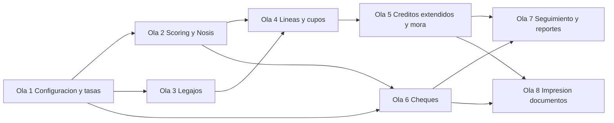

# Plan 55 - PrestaloApp: Plan Maestro Unico con Olas y Agentes

**Fecha:** 2026-03-18
**Proyecto:** `prestaloapp`
**Estado:** PLAN MAESTRO DE EJECUCION
**Objetivo:** dejar un unico plan operativo para ampliar PrestaloApp con creditos a personas, creditos a empresas, scoring configurable, lineas de credito, legajos y descuento de cheques

---

## 1. Vision general

PrestaloApp debe evolucionar desde el esquema actual de creditos de consumo puntuales hacia una plataforma financiera mas completa con tres lineas principales:

1. Creditos a personas.
2. Creditos a empresas.
3. Descuento o cambio de cheques.

La plataforma debe trabajar con:

- scoring propio;
- score externo Nosis;
- decision humana final;
- limites mensuales y totales;
- politicas por tipo de cliente;
- legajos documentales distintos para persona y empresa;
- operaciones de cheques con preoferta, liquidacion y seguimiento posterior.

---

## 2. Base existente del sistema

Hoy ya existe en `prestaloapp`:

- clientes;
- creditos;
- cuotas;
- cobros;
- asientos;
- cajas y sucursales;
- scoring basico;
- consulta Nosis;
- dashboard;
- cuenta corriente / ledger.

Tambien existe en `9001app-firebase` una referencia mas madura para la parte de riesgo crediticio:

- scoring con configuracion por organizacion;
- `score_nosis`;
- `tier_sugerido` y `tier_asignado`;
- `limite_credito_asignado`;
- `es_vigente`;
- aprobacion o rechazo humano;
- historial y log de consultas Nosis.

Ese enfoque debe ser tomado como referencia funcional para esta nueva etapa.

---

## 3. Definiciones de negocio confirmadas

### 3.1 Tipos de cliente y politicas

Toda politica debe ser multi-tenant por `organizationId` y configurable por tipo de cliente.

Debe existir clasificacion adicional al simple `persona/empresa`, por ejemplo:

- Persona A
- Persona B
- Empresa A
- Empresa B

Sobre esa clasificacion deben poder definirse:

- planes;
- tasas mensuales;
- punitorios;
- cargos fijos;
- cargos variables;
- politicas de cheque;
- exigencia de legajo;
- exigencia de evaluacion vigente.

### 3.2 Evaluacion de riesgo

La evaluacion debe combinar:

- scoring propio;
- score Nosis;
- criterio del analista;
- decision final aprobada o rechazada.

Debe contemplar:

- `tier_sugerido`;
- `tier_asignado`;
- `limite_sugerido`;
- `limite_credito_asignado`;
- `es_vigente`;
- historial de evaluaciones.

### 3.3 Limites

El sistema debe controlar como minimo:

- `limite_mensual`;
- `limite_total`.

Cada nuevo otorgamiento debe validar ambos.

### 3.4 Legajos

Los legajos de persona y empresa son distintos.

Ejemplos:

- persona: DNI, recibo de sueldo, ingresos, servicios, monotributo si aplica;
- empresa: balances, IVA, rentas, F.931, documentacion fiscal, societaria y bancaria.

### 3.5 Descuento de cheques

La operacion puede incluir uno o varios cheques.

Debe permitir:

- ingreso de fecha de vencimiento;
- calculo por dias corridos;
- preoferta previa;
- liquidacion por caja;
- asiento automatico;
- seguimiento posterior en Kanban.

Los cheques propios o de terceros deben poder habilitarse o no por politica.

### 3.6 Estados de cheques

Como minimo:

- recibido;
- en_cartera;
- depositado;
- acreditado;
- rechazado;
- pre_judicial;
- judicial.

---

## 4. Puntos abiertos que no bloquean el plan

- formula exacta de `consumo_mensual`;
- formula exacta de `consumo_total`;
- tratamiento definitivo del monotributo;
- si habra comite de credito en primera etapa;
- si el rechazo de cheque genera deuda automatica o caso asistido.

El plan deja estructura suficiente para resolver esos puntos sin rehacer la base.

---

## 5. Estrategia de implementacion

El orden correcto no es empezar por la UI de cheques ni por formularios complejos. Primero hay que consolidar reglas y dominio.

Orden recomendado:

1. configuracion base;
2. scoring y Nosis formalizados;
3. legajos;
4. lineas de credito;
5. creditos extendidos;
6. operaciones de cheques;
7. seguimiento Kanban y endurecimiento.

---

## 6. Resumen de olas

| Ola | Objetivo | Agentes | Paralelo interno | Depende de |
|---|---|---|---|---|
| 1 | Tipos de cliente, politicas y planes con tasas por cuotas | 1A, 1B, 1C | Si | Nada |
| 2 | Scoring configurable, evaluaciones y Nosis ampliado | 2A, 2B, 2C | Si | Ola 1 |
| 3 | Legajos persona y empresa | 3A, 3B, 3C | Si | Ola 1 |
| 4 | Lineas de credito y control de cupos | 4A, 4B, 4C | Si | Olas 2 y 3 |
| 5 | Creditos extendidos con snapshots de tasa y mora punitoria | 5A, 5B, 5C | Si | Ola 4 |
| 6 | Operaciones de descuento de cheques | 6A, 6B, 6C | Si | Olas 1 y 2 |
| 7 | Seguimiento de cheques, Kanban, rechazo y reportes base | 7A, 7B, 7C | Si | Olas 5 y 6 |
| 8 | Impresion de documentos: contratos, liquidaciones y recibos | 8A, 8B, 8C | Si | Olas 5 y 6 |

---

## 7. Reglas para todos los agentes

### 7.1 Reglas tecnicas

- verificar el directorio de trabajo antes de editar;
- respetar TypeScript strict;
- no romper clientes y creditos existentes;
- usar `withAuth()` en APIs;
- usar `apiFetch()` en cliente;
- usar Firebase Admin solo en servicios y API routes;
- mantener multi-tenancy por `organization_id`.

### 7.2 Regla de persistencia

Cada operacion debe guardar snapshot de las condiciones aplicadas, para no depender de configuraciones futuras:

- politica;
- plan;
- tasa;
- cargos;
- tier;
- limite asignado;
- score Nosis si aplica.

### 7.3 Verificacion

Despues de cada ola:

- `npx tsc --noEmit`
- prueba manual minima de rutas nuevas
- commit de checkpoint

Checkpoints recomendados:

- despues de Ola 2
- despues de Ola 4
- despues de Ola 6
- al cierre de Ola 7

---

## 8. OLA 1 - Tipos de cliente, politicas y planes

**Objetivo:** construir la base de configuracion del producto.

### Agentes de la ola

- `1A`: tipos y colecciones
- `1B`: servicios y APIs CRUD
- `1C`: UI de configuracion

### Prompt Agente 1A

```text
DIRECTORIO DE TRABAJO: c:\Users\Usuario\Documents\Proyectos\ISO -conjunto\prestaloapp
Verificar con pwd antes de editar.

CONTEXTO:
- Proyecto Next.js App Router con TypeScript strict
- Ya existen src/types/fin-cliente.ts, src/types/fin-credito.ts y src/firebase/collections.ts
- Necesitamos crear la base del dominio para tipos de cliente, politicas crediticias y planes de financiacion
- No romper el flujo actual de clientes y creditos

OBJETIVO:
Crear los tipos TypeScript y ampliar collections.ts para soportar:
- tipos de cliente
- politicas crediticias
- planes de financiacion

ARCHIVOS A CREAR:
- src/types/fin-tipo-cliente.ts
- src/types/fin-politica-crediticia.ts
- src/types/fin-plan-financiacion.ts

ARCHIVOS A MODIFICAR:
- src/firebase/collections.ts
- src/types/fin-cliente.ts
- src/types/fin-credito.ts

REQUISITOS:
- todo multi-tenant por organization_id
- create inputs sin ids ni metadata generada
- agregar helpers nuevos a FIN_COLLECTIONS
- en fin-cliente.ts agregar campos opcionales de clasificacion interna
- en fin-credito.ts agregar campos opcionales de trazabilidad: politica, plan, tipo_operacion y snapshots

ESTRUCTURA DE TASAS (OBLIGATORIO en fin-plan-financiacion.ts):

El tipo FinTramoTasa define la tasa para una cantidad de cuotas especifica:

  export interface FinTramoTasa {
    cantidad_cuotas: number;   // ej. 3, 6, 12, 18, 24
    tasa_mensual: number;      // tasa nominal mensual expresada como porcentaje, ej. 4.5 = 4.5%
  }

El tipo FinPlanFinanciacion debe incluir:

  export interface FinPlanFinanciacion {
    id: string;
    organization_id: string;
    nombre: string;
    politica_id: string;
    tramos_tasa: FinTramoTasa[];           // lista de tramos ordenados por cantidad_cuotas ascendente
    tasa_punitoria_mensual: number;        // tasa punitoria nominal mensual, ej. 8.0 = 8% mensual
    cargo_fijo?: number;                   // importe fijo por otorgamiento
    cargo_variable_pct?: number;           // porcentaje sobre capital
    activo: boolean;
    created_at: string;
    updated_at: string;
  }

Ejemplo de tramos_tasa valido:
  [
    { cantidad_cuotas: 3,  tasa_mensual: 4.5 },
    { cantidad_cuotas: 6,  tasa_mensual: 5.0 },
    { cantidad_cuotas: 12, tasa_mensual: 5.8 },
    { cantidad_cuotas: 18, tasa_mensual: 6.2 },
    { cantidad_cuotas: 24, tasa_mensual: 6.8 },
  ]

NOTA: Si la politica de cheques necesita tasas, se calculan por dias corridos sobre el campo
tasa_mensual del tramo de 1 cuota (o un tramo especial cantidad_cuotas=0 reservado para cheques).

REFERENCIAS:
- src/types/fin-cliente.ts
- src/types/fin-credito.ts
- src/firebase/collections.ts
- reports/42_PD-CRE-001_PROCESO_EVALUACION_RIESGO_CREDITO.md

CRITERIO DE EXITO:
- nuevos tipos creados
- collections.ts ampliado
- tipos actuales siguen compatibles
- npx tsc --noEmit pasa
```

### Prompt Agente 1B

```text
DIRECTORIO DE TRABAJO: c:\Users\Usuario\Documents\Proyectos\ISO -conjunto\prestaloapp
Verificar con pwd antes de editar.

CONTEXTO:
- Proyecto Next.js App Router
- Auth por src/lib/api/withAuth.ts
- Firebase Admin SDK en services
- Patrón de API existente en src/app/api/fin/creditos/route.ts
- Patrón de services existente en src/services/
- El agente 1A define los tipos de dominio y las colecciones nuevas

OBJETIVO:
Crear el backend CRUD para:
- tipos de cliente
- politicas crediticias
- planes de financiacion

ARCHIVOS A CREAR:
- src/services/TipoClienteService.ts
- src/services/PoliticaCrediticiaService.ts
- src/services/PlanFinanciacionService.ts
- src/app/api/fin/tipos-cliente/route.ts
- src/app/api/fin/tipos-cliente/[id]/route.ts
- src/app/api/fin/politicas-crediticias/route.ts
- src/app/api/fin/politicas-crediticias/[id]/route.ts
- src/app/api/fin/planes-financiacion/route.ts
- src/app/api/fin/planes-financiacion/[id]/route.ts

REQUISITOS:
- usar withAuth()
- usar Zod para validar POST y PATCH
- listas filtrables por tipo de cliente, estado y politica donde aplique
- toda entidad guardada con organization_id
- un plan debe pertenecer a una politica de la misma organizacion

METODO DE RESOLUCION DE TASA (OBLIGATORIO en PlanFinanciacionService.ts):

Agregar el metodo estatico puro:

  static resolverTasa(plan: FinPlanFinanciacion, cantidadCuotas: number): number {
    // Busca el tramo con cantidad_cuotas exacta
    const tramosOrdenados = [...plan.tramos_tasa].sort((a, b) => a.cantidad_cuotas - b.cantidad_cuotas);
    const exacto = tramosOrdenados.find((t) => t.cantidad_cuotas === cantidadCuotas);
    if (exacto) return exacto.tasa_mensual;
    // Si no hay match exacto, usa el tramo inmediatamente superior
    const superior = tramosOrdenados.find((t) => t.cantidad_cuotas > cantidadCuotas);
    if (superior) return superior.tasa_mensual;
    // Fallback: usa el ultimo tramo (el de mas cuotas)
    return tramosOrdenados[tramosOrdenados.length - 1].tasa_mensual;
  }

Este metodo debe usarse en:
- el calculo de amortizacion al crear credito
- el endpoint de preview de credito
- la UI de NuevoCreditoDialog para mostrar tasa calculada en tiempo real

REFERENCIAS:
- src/app/api/fin/creditos/route.ts
- src/services/ScoringService.ts
- src/lib/api/withAuth.ts
- src/firebase/collections.ts

CRITERIO DE EXITO:
- CRUD backend funcional
- filtros minimos funcionando
- respuestas consistentes
- resolverTasa() presente y testeado con 2-3 casos inline
- npx tsc --noEmit pasa
```

### Prompt Agente 1C

```text
DIRECTORIO DE TRABAJO: c:\Users\Usuario\Documents\Proyectos\ISO -conjunto\prestaloapp
Verificar con pwd antes de editar.

CONTEXTO:
- Proyecto con UI de clientes y creditos ya operativa
- apiFetch disponible
- componentes UI en src/components/ui/
- dialogs existentes en src/components/fin/dialogs/
- El backend de tipos/politicas/planes lo implementa el agente 1B

OBJETIVO:
Crear la UI minima de configuracion para:
- tipos de cliente
- politicas crediticias
- planes de financiacion

ARCHIVOS A CREAR:
- src/app/(dashboard)/tipos-cliente/page.tsx
- src/app/(dashboard)/politicas-crediticias/page.tsx
- src/app/(dashboard)/planes-financiacion/page.tsx
- src/components/fin/dialogs/NuevoTipoClienteDialog.tsx
- src/components/fin/dialogs/NuevaPoliticaCrediticiaDialog.tsx
- src/components/fin/dialogs/NuevoPlanFinanciacionDialog.tsx

REQUISITOS:
- usar 'use client'
- fetch con apiFetch
- loading, empty state y refresco al guardar
- formularios con React Hook Form + Zod
- estilo consistente con creditos/page.tsx y NuevoCreditoDialog.tsx

EDITOR DE TRAMOS DE TASA (OBLIGATORIO en NuevoPlanFinanciacionDialog.tsx):

El formulario de plan de financiacion debe incluir:

1. Campo `tasa_punitoria_mensual` de tipo numero con label "Tasa punitoria mensual (%)"

2. Editor de tramos de tasa como grilla editable:
   - Titulo: "Tramos de tasa por cuotas"
   - Tabla con columnas: "Cuotas" | "Tasa mensual (%)" | "Eliminar"
   - Boton "Agregar tramo" que agrega una fila vacia al array tramos_tasa
   - Cada fila tiene:
     - Input numerico para cantidad_cuotas (ej. 3, 6, 12)
     - Input numerico para tasa_mensual (ej. 4.5)
     - Boton de eliminar fila (icono Trash2 de lucide)
   - Los tramos se ordenan visualmente por cantidad_cuotas ascendente
   - Validacion: minimo 1 tramo, cantidad_cuotas > 0, tasa_mensual > 0
   - Al guardar, los tramos se envian ordenados por cantidad_cuotas

3. En el panel de preview (si se muestra la amortizacion en el dialog de credito),
   llamar a PlanFinanciacionService.resolverTasa(plan, cantidadCuotas) y mostrar
   la tasa aplicada debajo del selector de cuotas.

REFERENCIAS:
- src/app/(dashboard)/creditos/page.tsx
- src/app/(dashboard)/clientes/page.tsx
- src/components/fin/dialogs/NuevoCreditoDialog.tsx
- src/components/fin/dialogs/NuevoClienteDialog.tsx

CRITERIO DE EXITO:
- se navega a las 3 pantallas
- se pueden crear registros con tramos de tasa configurados
- las listas se refrescan
- el editor de tramos agrega y elimina filas correctamente
- npx tsc --noEmit pasa
```

---

## 9. OLA 2 - Scoring configurable, evaluaciones y Nosis ampliado

**Objetivo:** formalizar la evaluacion de riesgo tomando como referencia `9001app-firebase`.

### Agentes de la ola

- `2A`: tipos y servicio de evaluacion
- `2B`: configuracion de scoring y APIs
- `2C`: UI de evaluacion y Nosis

### Prompt Agente 2A

```text
DIRECTORIO DE TRABAJO: c:\Users\Usuario\Documents\Proyectos\ISO -conjunto\prestaloapp
Verificar con pwd antes de editar.

CONTEXTO:
- En prestaloapp ya existe src/types/fin-evaluacion.ts y src/services/ScoringService.ts
- En 9001app-firebase existe una version mas madura:
  - src/types/crm-evaluacion-riesgo.ts
  - src/services/crm/EvaluacionRiesgoService.ts
- Debemos llevar ese modelo al dominio fin_ sin copiar el CRM completo

OBJETIVO:
Extender la evaluacion de riesgo para soportar:
- score_nosis
- tier_sugerido
- tier_asignado
- limite_sugerido
- limite_credito_asignado
- es_vigente
- aprobada/rechazada
- historial

ARCHIVOS A MODIFICAR O CREAR:
- src/types/fin-evaluacion.ts
- src/services/ScoringService.ts
- src/firebase/collections.ts si hace falta nueva config

REQUISITOS:
- marcar evaluaciones anteriores como no vigentes al crear una nueva
- separar resultado calculado de decision humana
- persistir score propio y score Nosis
- dejar metodos para aprobar y rechazar evaluacion

REFERENCIAS:
- c:\Users\Usuario\Documents\Proyectos\ISO -conjunto\9001app-firebase\src\types\crm-evaluacion-riesgo.ts
- c:\Users\Usuario\Documents\Proyectos\ISO -conjunto\9001app-firebase\src\services\crm\EvaluacionRiesgoService.ts
- reports/42_PD-CRE-001_PROCESO_EVALUACION_RIESGO_CREDITO.md

CRITERIO DE EXITO:
- evaluaciones mas ricas y vigentes
- servicio con create, aprobar, rechazar y getUltimaEvaluacion
- npx tsc --noEmit pasa
```

### Prompt Agente 2B

```text
DIRECTORIO DE TRABAJO: c:\Users\Usuario\Documents\Proyectos\ISO -conjunto\prestaloapp
Verificar con pwd antes de editar.

CONTEXTO:
- Debemos agregar configuracion de scoring por organizacion y mejorar la integracion Nosis
- En 9001app-firebase existe:
  - src/app/api/crm/config/scoring/route.ts
  - src/services/NosisService.ts
- En prestaloapp ya existe src/app/api/fin/clientes/[id]/nosis/route.ts

OBJETIVO:
Implementar:
- config de scoring por organizacion
- API para leer/editar esa config
- mejora del flujo Nosis con historial/log de consulta

ARCHIVOS A CREAR O MODIFICAR:
- src/types/fin-evaluacion.ts
- src/app/api/fin/config/scoring/route.ts
- src/services/NosisService.ts
- src/app/api/fin/clientes/[id]/nosis/route.ts
- src/services/ClienteService.ts si hace falta soporte extra

REQUISITOS:
- pesos por categoria
- umbrales por tier
- frecuencia de vigencia
- historial de consultas Nosis bajo el cliente
- guardar tiempo de respuesta, estado y raw response

REFERENCIAS:
- c:\Users\Usuario\Documents\Proyectos\ISO -conjunto\9001app-firebase\src\app\api\crm\config\scoring\route.ts
- c:\Users\Usuario\Documents\Proyectos\ISO -conjunto\9001app-firebase\src\services\NosisService.ts
- src/app/api/fin/clientes/[id]/nosis/route.ts

CRITERIO DE EXITO:
- config scoring editable
- Nosis con log historico
- npx tsc --noEmit pasa
```

### Prompt Agente 2C

```text
DIRECTORIO DE TRABAJO: c:\Users\Usuario\Documents\Proyectos\ISO -conjunto\prestaloapp
Verificar con pwd antes de editar.

CONTEXTO:
- Ya existe una UI de evaluacion en src/app/(dashboard)/clientes/[id]/evaluacion/page.tsx
- Debe enriquecerse con score Nosis, vigencia, aprobacion y limite asignado
- Tambien hay secciones de scoring en la ficha de cliente

OBJETIVO:
Mejorar la UI de evaluacion crediticia y de Nosis para mostrar:
- score calculado
- score Nosis
- tier sugerido
- tier asignado
- limite sugerido
- limite asignado
- estado y vigencia
- historial

ARCHIVOS A MODIFICAR:
- src/app/(dashboard)/clientes/[id]/evaluacion/page.tsx
- src/app/(dashboard)/clientes/[id]/page.tsx
- componentes asociados si hacen falta

REQUISITOS:
- mostrar resumen claro
- permitir aprobacion/rechazo si backend lo expone
- mostrar ultima consulta Nosis e historial
- mantener UX consistente con el dashboard actual

REFERENCIAS:
- src/app/(dashboard)/clientes/[id]/evaluacion/page.tsx
- src/app/(dashboard)/clientes/[id]/page.tsx
- c:\Users\Usuario\Documents\Proyectos\ISO -conjunto\9001app-firebase\src\components\crm\CreditoScoringTab.tsx

CRITERIO DE EXITO:
- ficha del cliente muestra evaluacion vigente mas rica
- Nosis visible y util
- npx tsc --noEmit pasa
```

---

## 10. OLA 3 - Legajos persona y empresa

**Objetivo:** resolver la capa documental.

### Agentes de la ola

- `3A`: tipos, plantillas y reglas de legajo
- `3B`: servicios y APIs
- `3C`: UI en ficha de cliente

### Prompt Agente 3A

```text
DIRECTORIO DE TRABAJO: c:\Users\Usuario\Documents\Proyectos\ISO -conjunto\prestaloapp
Verificar con pwd antes de editar.

OBJETIVO:
Crear el modelo de legajo para personas y empresas.

ARCHIVOS A CREAR:
- src/types/fin-legajo.ts
- src/lib/fin/legajo-templates.ts
- src/lib/fin/legajo-rules.ts

REQUISITOS:
- plantillas distintas para persona y empresa
- dejar preparada una variante futura de monotributo
- documentos con obligatorio, estado, vencimiento y observaciones

CRITERIO DE EXITO:
- tipado y plantillas listas
- npx tsc --noEmit pasa
```

### Prompt Agente 3B

```text
DIRECTORIO DE TRABAJO: c:\Users\Usuario\Documents\Proyectos\ISO -conjunto\prestaloapp
Verificar con pwd antes de editar.

OBJETIVO:
Crear backend de legajos y documentos.

ARCHIVOS A CREAR:
- src/services/LegajoService.ts
- src/app/api/fin/clientes/[id]/legajo/route.ts
- src/app/api/fin/clientes/[id]/legajo/documentos/route.ts
- src/app/api/fin/clientes/[id]/legajo/documentos/[docId]/route.ts

REQUISITOS:
- crear o recuperar legajo por cliente
- listar, agregar y actualizar documentos
- informar si el legajo esta completo

REFERENCIAS:
- patrones de routes fin/ actuales
- collections.ts

CRITERIO DE EXITO:
- endpoints funcionales
- npx tsc --noEmit pasa
```

### Prompt Agente 3C

```text
DIRECTORIO DE TRABAJO: c:\Users\Usuario\Documents\Proyectos\ISO -conjunto\prestaloapp
Verificar con pwd antes de editar.

OBJETIVO:
Agregar a la ficha del cliente un tab de legajo.

ARCHIVOS A CREAR O MODIFICAR:
- src/app/(dashboard)/clientes/[id]/page.tsx
- componentes en src/components/fin/cliente/

REQUISITOS:
- mostrar checklist por tipo de cliente
- mostrar documentos cargados
- permitir alta/edicion basica
- mostrar si el legajo esta completo o incompleto

CRITERIO DE EXITO:
- tab legajo visible y util
- npx tsc --noEmit pasa
```

---

## 11. OLA 4 - Lineas de credito y control de cupos

**Objetivo:** volver operativo el scoring.

### Agentes de la ola

- `4A`: tipos y servicio de linea
- `4B`: API y recalculo de cupo
- `4C`: UI de resumen crediticio

### Prompt Agente 4A

```text
DIRECTORIO DE TRABAJO: c:\Users\Usuario\Documents\Proyectos\ISO -conjunto\prestaloapp
Verificar con pwd antes de editar.

OBJETIVO:
Crear el modelo de linea de credito.

ARCHIVOS A CREAR:
- src/types/fin-linea-credito.ts
- src/services/LineaCreditoService.ts

REQUISITOS:
- limite_mensual
- limite_total
- consumo actual
- disponible actual
- vigencia
- referencia a evaluacion vigente

CRITERIO DE EXITO:
- servicio y tipo listos
- npx tsc --noEmit pasa
```

### Prompt Agente 4B

```text
DIRECTORIO DE TRABAJO: c:\Users\Usuario\Documents\Proyectos\ISO -conjunto\prestaloapp
Verificar con pwd antes de editar.

OBJETIVO:
Exponer APIs para linea de credito y recalculo de cupo.

ARCHIVOS A CREAR:
- src/app/api/fin/clientes/[id]/linea/route.ts
- src/app/api/fin/clientes/[id]/linea/recalcular/route.ts

REQUISITOS:
- GET linea actual
- POST/PATCH para asignar linea
- endpoint de recalculo
- uso de organization_id y validaciones

CRITERIO DE EXITO:
- backend funcional
- npx tsc --noEmit pasa
```

### Prompt Agente 4C

```text
DIRECTORIO DE TRABAJO: c:\Users\Usuario\Documents\Proyectos\ISO -conjunto\prestaloapp
Verificar con pwd antes de editar.

OBJETIVO:
Mostrar en la ficha del cliente su linea y consumo.

ARCHIVOS A CREAR O MODIFICAR:
- src/app/(dashboard)/clientes/[id]/page.tsx
- componentes de resumen crediticio

REQUISITOS:
- mostrar tier vigente
- mostrar limite mensual y total
- mostrar consumido y disponible
- avisos visuales si esta al limite

CRITERIO DE EXITO:
- resumen crediticio visible
- npx tsc --noEmit pasa
```

---

## 12. OLA 5 - Creditos extendidos a personas y empresas

**Objetivo:** extender el otorgamiento actual.

### Agentes de la ola

- `5A`: servicio y API de credito
- `5B`: UI de otorgamiento
- `5C`: detalle y trazabilidad

### Prompt Agente 5A

```text
DIRECTORIO DE TRABAJO: c:\Users\Usuario\Documents\Proyectos\ISO -conjunto\prestaloapp
Verificar con pwd antes de editar.

OBJETIVO:
Extender CreditoService y APIs para otorgar credito bajo politica y cupo.

ARCHIVOS A MODIFICAR:
- src/services/CreditoService.ts
- src/app/api/fin/creditos/route.ts
- src/app/api/fin/creditos/preview/route.ts
- src/types/fin-credito.ts

REQUISITOS:
- validar linea disponible
- validar evaluacion vigente si la politica lo requiere
- validar legajo completo si la politica lo requiere
- guardar politica, plan y snapshots

SNAPSHOTS DE TASA (OBLIGATORIO):

Al otorgar un credito, fin-credito.ts debe guardar los siguientes campos snapshot:

  snapshot_tasa_mensual: number;              // tasa resuelta por PlanFinanciacionService.resolverTasa()
  snapshot_tasa_punitoria_mensual: number;    // tasa_punitoria_mensual del plan al momento del otorgamiento
  snapshot_cargo_fijo?: number;               // cargo_fijo del plan si aplica
  snapshot_cargo_variable_pct?: number;       // cargo_variable_pct del plan si aplica

CALCULO DE MORA E INTERES PUNITORIO:

Agregar en CreditoService el metodo calcularMora:

  calcularMora(credito: FinCredito, cuota: FinCuota, fechaCalculo: Date): number {
    const diasVencidos = Math.max(0, diferenciaDias(new Date(cuota.fecha_vencimiento), fechaCalculo));
    if (diasVencidos === 0) return 0;
    // tasa diaria equivalente a partir de la tasa punitoria mensual (base 30 dias)
    const tasaDiaria = credito.snapshot_tasa_punitoria_mensual / 100 / 30;
    return cuota.total * tasaDiaria * diasVencidos;
  }

La tasa punitoria se toma SIEMPRE del snapshot del credito, no de la configuracion actual.
Esto garantiza que condiciones futuras no afecten deudas anteriores.

El campo `mora_calculada` en el tipo FinCuota es informativo y debe ser recalculado
en tiempo real al mostrar la cuota al usuario, no persistido.

REFERENCIAS:
- CreditoService actual
- LineaCreditoService
- PoliticaCrediticiaService

CRITERIO DE EXITO:
- no se puede otorgar fuera de cupo
- snapshots de tasa y punitorio guardados
- calcularMora usa snapshot_tasa_punitoria_mensual
- npx tsc --noEmit pasa
```

### Prompt Agente 5B

```text
DIRECTORIO DE TRABAJO: c:\Users\Usuario\Documents\Proyectos\ISO -conjunto\prestaloapp
Verificar con pwd antes de editar.

OBJETIVO:
Actualizar la UI de otorgamiento para personas y empresas bajo politica.

ARCHIVOS A MODIFICAR:
- src/components/fin/dialogs/NuevoCreditoDialog.tsx
- src/app/(dashboard)/creditos/nuevo/page.tsx
- src/app/(dashboard)/creditos/page.tsx

REQUISITOS:
- selector de politica y plan
- mostrar cupo disponible
- mensajes claros si bloquea por limite, scoring o legajo
- mantener compatibilidad con flujo actual

CRITERIO DE EXITO:
- formulario enriquecido y usable
- npx tsc --noEmit pasa
```

### Prompt Agente 5C

```text
DIRECTORIO DE TRABAJO: c:\Users\Usuario\Documents\Proyectos\ISO -conjunto\prestaloapp
Verificar con pwd antes de editar.

OBJETIVO:
Mejorar el detalle del credito para mostrar trazabilidad de condiciones aplicadas.

ARCHIVOS A MODIFICAR:
- src/app/(dashboard)/creditos/[id]/page.tsx

REQUISITOS:
- mostrar tipo de operacion
- mostrar politica y plan aplicados
- mostrar snapshots basicos
- conservar info existente del credito

CRITERIO DE EXITO:
- detalle de credito mas explicativo
- npx tsc --noEmit pasa
```

---

## 13. OLA 6 - Operaciones de descuento de cheques

**Objetivo:** construir el modulo de descuento.

### Agentes de la ola

- `6A`: tipos, servicios y asientos
- `6B`: APIs preview y confirmacion
- `6C`: UI de carga y detalle

### Prompt Agente 6A

```text
DIRECTORIO DE TRABAJO: c:\Users\Usuario\Documents\Proyectos\ISO -conjunto\prestaloapp
Verificar con pwd antes de editar.

OBJETIVO:
Crear el dominio de operaciones de cheque.

ARCHIVOS A CREAR:
- src/types/fin-operacion-cheque.ts
- src/types/fin-cheque.ts
- src/services/OperacionChequeService.ts
- src/services/ChequeService.ts

ARCHIVOS A MODIFICAR:
- src/services/JournalEntryService.ts
- src/firebase/collections.ts

REQUISITOS:
- cabecera de operacion
- detalle por cheque
- soporte de multiples cheques
- base contable para liquidacion

CRITERIO DE EXITO:
- dominio listo
- npx tsc --noEmit pasa
```

### Prompt Agente 6B

```text
DIRECTORIO DE TRABAJO: c:\Users\Usuario\Documents\Proyectos\ISO -conjunto\prestaloapp
Verificar con pwd antes de editar.

OBJETIVO:
Crear APIs de preview y confirmacion de operaciones de cheque.

ARCHIVOS A CREAR:
- src/app/api/fin/operaciones-cheques/preview/route.ts
- src/app/api/fin/operaciones-cheques/route.ts
- src/app/api/fin/operaciones-cheques/[id]/route.ts
- src/app/api/fin/cheques/route.ts
- src/app/api/fin/cheques/[id]/route.ts

REQUISITOS:
- calculo por dias corridos
- aplicar politica del tipo de cliente
- soportar gastos fijos y variables
- confirmar liquidacion por caja

CRITERIO DE EXITO:
- preview correcto
- alta de operacion correcta
- npx tsc --noEmit pasa
```

### Prompt Agente 6C

```text
DIRECTORIO DE TRABAJO: c:\Users\Usuario\Documents\Proyectos\ISO -conjunto\prestaloapp
Verificar con pwd antes de editar.

OBJETIVO:
Crear la UI de operaciones de cheque.

ARCHIVOS A CREAR:
- src/app/(dashboard)/operaciones-cheques/page.tsx
- src/app/(dashboard)/operaciones-cheques/nueva/page.tsx
- src/app/(dashboard)/operaciones-cheques/[id]/page.tsx
- componentes asociados

REQUISITOS:
- carga de varios cheques
- preview de oferta
- mostrar nominal, descuento, gastos y neto
- detalle de operacion posterior

CRITERIO DE EXITO:
- flujo basico usable
- npx tsc --noEmit pasa
```

---

## 14. OLA 7 - Seguimiento de cheques, Kanban y reportes base

**Objetivo:** cerrar el circuito operativo.

### Agentes de la ola

- `7A`: estados y eventos de cheque
- `7B`: Kanban y detalle
- `7C`: reportes y endurecimiento

### Prompt Agente 7A

```text
DIRECTORIO DE TRABAJO: c:\Users\Usuario\Documents\Proyectos\ISO -conjunto\prestaloapp
Verificar con pwd antes de editar.

OBJETIVO:
Implementar cambios de estado y eventos de cheque.

ARCHIVOS A CREAR O MODIFICAR:
- src/app/api/fin/cheques/[id]/estado/route.ts
- src/services/ChequeService.ts
- tipos de cheque si hace falta

REQUISITOS:
- recibido
- en_cartera
- depositado
- acreditado
- rechazado
- pre_judicial
- judicial
- historico de eventos
- gastos editables en rechazo

CRITERIO DE EXITO:
- estados auditados
- npx tsc --noEmit pasa
```

### Prompt Agente 7B

```text
DIRECTORIO DE TRABAJO: c:\Users\Usuario\Documents\Proyectos\ISO -conjunto\prestaloapp
Verificar con pwd antes de editar.

OBJETIVO:
Construir Kanban y detalle de cheque.

ARCHIVOS A CREAR:
- src/app/(dashboard)/cheques/kanban/page.tsx
- src/app/(dashboard)/cheques/[id]/page.tsx
- componentes en src/components/fin/cheques/

REQUISITOS:
- columnas por estado
- tarjetas operativas
- detalle con historial
- accion de cambio de estado

CRITERIO DE EXITO:
- Kanban util
- npx tsc --noEmit pasa
```

### Prompt Agente 7C

```text
DIRECTORIO DE TRABAJO: c:\Users\Usuario\Documents\Proyectos\ISO -conjunto\prestaloapp
Verificar con pwd antes de editar.

OBJETIVO:
Agregar reportes base y endurecimiento final.

ARCHIVOS SUGERIDOS:
- paginas de reportes
- tests de servicios clave
- seeds demo si hace falta

REQUISITOS:
- reporte de lineas consumidas
- reporte de cartera de cheques por estado
- reporte de rechazados
- pruebas basicas de scoring, linea y cheque

CRITERIO DE EXITO:
- visibilidad minima operativa
- npx tsc --noEmit pasa
```

---

## 15. OLA 8 - Impresion de documentos

**Objetivo:** generar e imprimir documentos operativos sin servidor de PDF externo.

La estrategia es routes dedicadas que renderizan HTML optimizado para impresion con CSS `@media print`. El usuario abre la URL en una nueva pestaña y usa la impresion del navegador (o Ctrl+P). No se requiere ninguna libreria externa de generacion de PDF.

### Agentes de la ola

- `8A`: tipos y rutas de impresion
- `8B`: templates HTML de documentos
- `8C`: triggers en UI

### Prompt Agente 8A

```text
DIRECTORIO DE TRABAJO: c:\Users\Usuario\Documents\Proyectos\ISO -conjunto\prestaloapp
Verificar con pwd antes de editar.

CONTEXTO:
- Next.js App Router
- Ya existen creditos, cobros y operaciones de cheques
- La estrategia de impresion es HTML con @media print sin libreria de PDF externa

OBJETIVO:
Crear la infraestructura base para las rutas de impresion.

ARCHIVOS A CREAR:
- src/types/fin-print.ts
- src/app/(print)/layout.tsx
- src/app/(print)/print/credito/[id]/page.tsx     (estructura base, contenido en 8B)
- src/app/(print)/print/cobro/[id]/page.tsx        (estructura base, contenido en 8B)
- src/app/(print)/print/cheque/[id]/page.tsx       (estructura base, contenido en 8B)
- src/app/globals.css  (agregar media print utilities si no existen)

REQUISITOS:
- el layout (print) no debe tener sidebar ni topbar, solo el documento imprimible
- agregar en globals.css la regla @media print { .no-print { display: none; } body { background: white; } }
- cada ruta de impresion recibe el id como param y carga los datos via Firebase Admin (server component)
- usar withAuth del lado server para proteger las rutas de impresion
- el tipo FinPrintMeta debe contener: document_type, document_id, organization_id, generated_at, generated_by

CRITERIO DE EXITO:
- rutas accesibles y protegidas
- layout limpio sin chrome del dashboard
- npx tsc --noEmit pasa
```

### Prompt Agente 8B

```text
DIRECTORIO DE TRABAJO: c:\Users\Usuario\Documents\Proyectos\ISO -conjunto\prestaloapp
Verificar con pwd antes de editar.

CONTEXTO:
- Las rutas de impresion fueron creadas por el agente 8A
- Existen tipos FinCredito, FinCuota, FinCobro, FinOperacionCheque, FinCheque
- El layout (print) ya esta listo

OBJETIVO:
Implementar el contenido de cada documento imprimible.

ARCHIVOS A MODIFICAR:
- src/app/(print)/print/credito/[id]/page.tsx
- src/app/(print)/print/cobro/[id]/page.tsx
- src/app/(print)/print/cheque/[id]/page.tsx

ARCHIVOS A CREAR:
- src/components/print/ContratoCredito.tsx
- src/components/print/ReciboCobro.tsx
- src/components/print/LiquidacionCheque.tsx

DOCUMENTOS A IMPLEMENTAR:

1. CONTRATO DE CREDITO (print/credito/[id]):
   - Datos de la organizacion (nombre, CUIT, domicilio)
   - Datos del cliente (nombre, CUIT, domicilio)
   - Condiciones del credito: capital, sistema, cuotas, tasa mensual aplicada (snapshot_tasa_mensual)
   - Tabla de amortizacion completa (todas las cuotas con fecha, capital, interes, total)
   - Nota de tasa punitoria (snapshot_tasa_punitoria_mensual)
   - Lugar para firmas: cliente y representante de la empresa
   - Pie de pagina con numero de credito y fecha de impresion

2. RECIBO DE COBRO (print/cobro/[id]):
   - Numero de recibo (usar cobro.id primeros 8 chars)
   - Datos del cliente
   - Detalle de la cuota pagada: numero de cuota, credito, capital, interes, total cobrado
   - Caja y sucursal donde se cobro
   - Fecha y hora del cobro
   - Firma del cobrador
   - Pie con nota de validez

3. LIQUIDACION DE CHEQUE (print/cheque/[id]):
   - Datos del presentante (cliente)
   - Tabla con cheques incluidos: banco, numero, CUIT librador, fecha vto, valor nominal
   - Calculo: suma nominal, dias promedio ponderados, descuento, gastos fijos, gastos variables, neto a acreditar
   - Condiciones aplicadas (snapshot de politica: tasa diaria usada, gastos)
   - Firma y fecha de liquidacion

REQUISITOS GENERALES:
- usar Tailwind con clases print-friendly (no colores que no imprimen, usar border-black, text-black)
- encabezado con logo o nombre de la organizacion cargado desde Firestore
- cada documento debe tener un boton "Imprimir" con clase no-print que llama window.print()
- los componentes ContratoCredito, ReciboCobro y LiquidacionCheque son Server Components puros

CRITERIO DE EXITO:
- los 3 documentos renderizan correctamente
- al imprimir se oculta el boton
- la tabla de amortizacion es legible
- npx tsc --noEmit pasa
```

### Prompt Agente 8C

```text
DIRECTORIO DE TRABAJO: c:\Users\Usuario\Documents\Proyectos\ISO -conjunto\prestaloapp
Verificar con pwd antes de editar.

CONTEXTO:
- Las rutas de impresion /print/credito/[id], /print/cobro/[id] y /print/cheque/[id] ya existen
- Necesitamos agregar botones de impresion en los lugares correctos del dashboard

OBJETIVO:
Agregar acciones de impresion en las fichas del dashboard.

ARCHIVOS A MODIFICAR:
- src/app/(dashboard)/creditos/[id]/page.tsx
- src/app/(dashboard)/cobros/[id]/page.tsx (si existe) o en el listado de cobros del credito
- src/app/(dashboard)/operaciones-cheques/[id]/page.tsx

REQUISITOS:
- en la ficha del credito: boton "Imprimir contrato" que abre /print/credito/[id] en nueva pestana
- en cada cobro registrado: boton o link "Imprimir recibo" que abre /print/cobro/[id] en nueva pestana
- en el detalle de operacion de cheque: boton "Imprimir liquidacion" que abre /print/cheque/[id] en nueva pestana
- usar target="_blank" rel="noopener noreferrer" al abrir
- los botones deben usar el icono Printer de lucide-react
- no bloquear ni reemplazar el flujo actual, solo agregar la accion

CRITERIO DE EXITO:
- botones de impresion visibles en los lugares correctos
- se abre la ruta correcta en nueva pestana
- el documento renderiza y se puede imprimir con Ctrl+P
- npx tsc --noEmit pasa
```

---

## 16. Dependencias visuales entre olas



---

## 16. Orden real recomendado

Si queres menor riesgo tecnico:

1. Ola 1
2. Ola 2
3. Ola 3
4. Ola 4
5. Ola 5
6. Ola 6
7. Ola 7
8. Ola 8

La Ola 8 puede comenzar en paralelo con la Ola 7 ya que solo necesita que
los servicios de Ola 5 (creditos con snapshots) y Ola 6 (cheques) esten listos.

---

## 17. Resultado esperado al final

PrestaloApp debe quedar preparado para operar como plataforma financiera con:

- personas y empresas en un mismo core;
- scoring propio configurable;
- Nosis integrado con historial;
- tier sugerido y asignado;
- limite sugerido y asignado;
- lineas de credito vigentes;
- legajos diferenciados;
- otorgamiento bajo cupo;
- tasas por tramos de cuotas configurables por plan;
- tasa punitoria mensual configurable por plan;
- snapshots inmutables de condiciones al momento del otorgamiento;
- calculo de mora sobre tasa punitoria del snapshot (no de configuracion actual);
- descuento de cheques con preoferta;
- seguimiento Kanban;
- trazabilidad contable y operativa;
- impresion de contrato de credito, recibo de cobro y liquidacion de cheque desde el navegador sin dependencias externas.

