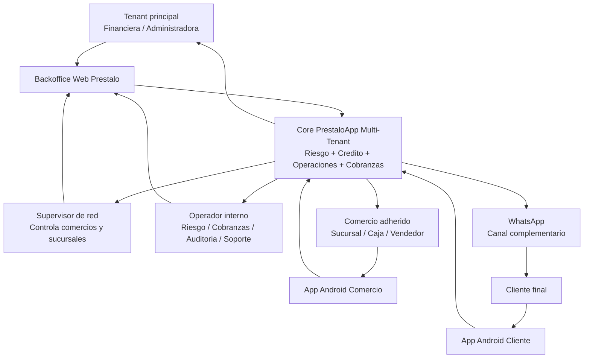
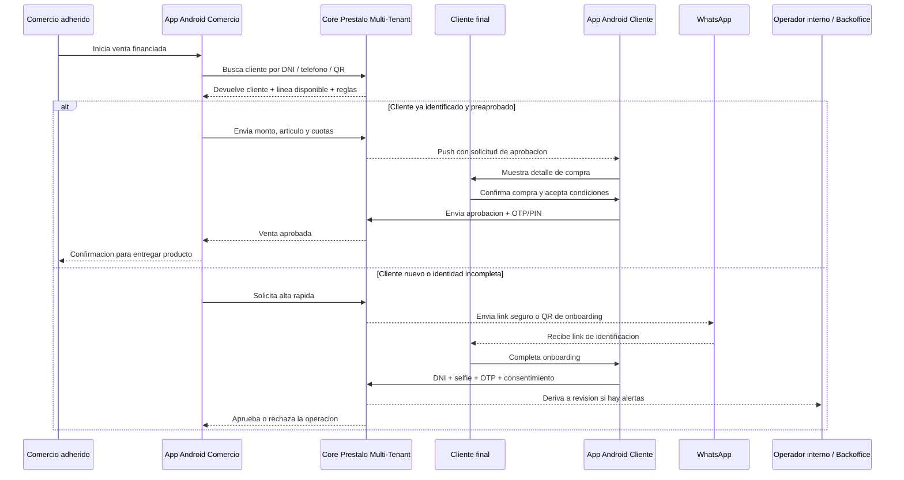

# Plan 67 - Plataforma Android Multi-Tenant de Credito para Comercios PrestaloApp
**Fecha:** 2026-04-05
**Estado:** Propuesta funcional y tecnica
**Horizonte:** MVP 90 dias + evolucion 6-12 meses
**Proyectos afectados:** `prestaloapp`

---

## Resumen ejecutivo

La recomendacion para `PrestaloApp` es construir una plataforma de `credito embebido para comercios adheridos` con arquitectura `multi-tenant`, operacion principal en `Android` y `WhatsApp` como canal complementario.

No se recomienda una tarjeta de credito clasica para la fase inicial.

La propuesta base es:

- `App Android Cliente` para identidad, linea disponible, aprobacion y seguimiento
- `App Android Comercio` para originar ventas, generar QR o link y consultar estado
- `Backoffice Web` para administracion, riesgo, cobranzas y configuracion
- `WhatsApp` para onboarding asistido, recordatorios, aprobaciones remotas y cobranzas
- `Core multi-tenant` con separacion estricta por organizacion y por red comercial

El patron de mercado mas razonable para este producto se parece a:

- `BNPL / credito en checkout` como Addi o Atrato Pago
- `QR y cobro movil` como Mercado Pago QR
- `mensajeria como canal de soporte y conversion` como WhatsApp Business

---

## Objetivo de negocio

Permitir que una financiera o red comercial otorgue credito en comercios asociados sin tarjeta fisica, usando identidad digital, aprobacion en el momento y trazabilidad total por tenant, comercio, operador y cliente.

Objetivos concretos:

- vender credito en punto de venta con baja friccion
- reutilizar clientes preaprobados en multiples comercios adheridos
- operar con costos mas bajos que un esquema de tarjeta
- mantener control de riesgo, antifraude y cobranzas desde el core
- soportar multiples organizaciones en una misma plataforma

---

## Decisiones de producto

### 1. Canal primario

El canal principal debe ser `Android`.

Motivos:

- mejor control del flujo de identidad y biometria
- mejor experiencia en comercios con app dedicada
- capacidad offline limitada pero util para cache y continuidad operativa
- mejor uso de camara para DNI, selfie, documentos y QR
- notificaciones push para cobranza, vencimientos y seguimiento

### 2. Rol de WhatsApp

`WhatsApp` no debe ser el core de identidad ni de aprobacion final en operaciones sensibles.

Debe usarse para:

- iniciar conversaciones
- enviar links seguros
- reenviar propuestas
- recordar cuotas o promesas
- confirmar operaciones remotas de bajo o medio riesgo con OTP
- cobranza temprana y seguimiento

### 3. Modelo comercial

El producto debe operar como `closed-loop credit network`:

- clientes registrados y evaluados dentro del ecosistema Prestalo
- comercios adheridos con reglas y comisiones propias
- limite de credito administrado por la financiera
- compras realizadas solo dentro de la red habilitada

### 4. Multi-tenancy

La plataforma debe ser `multi-tenant nativa`, no adaptada despues.

Cada tenant representa una financiera, marca o grupo operador con:

- clientes
- comercios
- reglas de scoring
- branding
- tasas
- limites
- circuitos de cobranza
- usuarios y permisos

---

## Actores del sistema

### Tenant principal

Organizacion financiera o administradora.

### Comercio adherido

Sucursal o comercio autorizado a originar ventas financiadas.

### Cliente final

Persona que se identifica, recibe una linea y compra en comercios adheridos.

### Operador interno

Usuarios de administracion, riesgo, cobranzas, auditoria y soporte.

### Supervisor de red

Rol intermedio para gestionar varios comercios dentro de un tenant.

---

## Grafico de operatoria

### 1. Mapa general de actores y canales



### 2. Operatoria de venta financiada en comercio



### 3. Vista operacional por roles

```mermaid
flowchart LR
    subgraph Tenant["Tenant principal"]
        T1["Define reglas"]
        T2["Configura tasas"]
        T3["Administra usuarios"]
    end

    subgraph Red["Supervisor de red"]
        R1["Controla comercios"]
        R2["Controla sucursales"]
        R3["Monitorea volumen y desvio"]
    end

    subgraph Comercio["Comercio adherido"]
        M1["Origina venta"]
        M2["Consulta estado"]
        M3["Genera QR / link"]
    end

    subgraph Cliente["Cliente final"]
        CL1["Se identifica"]
        CL2["Consulta linea"]
        CL3["Aprueba compra"]
        CL4["Paga cuotas"]
    end

    subgraph Interno["Operador interno"]
        I1["Riesgo"]
        I2["Cobranzas"]
        I3["Auditoria"]
        I4["Soporte"]
    end

    Tenant --> Red
    Red --> Comercio
    Comercio --> Cliente
    Cliente --> Interno
    Interno --> Tenant
```



### 4. Lectura simple del circuito

```text
Tenant principal
   -> define reglas, limites, usuarios y red comercial

Supervisor de red
   -> controla varios comercios y sucursales del tenant

Comercio adherido
   -> usa App Android Comercio para iniciar la venta

Cliente final
   -> usa App Android Cliente para identificarse y aprobar

Core Prestalo Multi-Tenant
   -> valida identidad, riesgo, linea, autorizacion y registra la operacion

Operador interno
   -> interviene en riesgo, soporte, auditoria y cobranzas

WhatsApp
   -> acompana onboarding, recordatorios, links y seguimiento
```

---

## Propuesta de canales y aplicaciones

## A. App Android Cliente

Funciones minimas:

- registro y login
- vinculacion de telefono y dispositivo
- validacion de identidad
- consulta de linea disponible
- aprobacion de compra
- firma/aceptacion de terminos
- visualizacion de cuotas y vencimientos
- pagos y recordatorios
- estado de solicitudes
- centro de ayuda y contacto por WhatsApp

## B. App Android Comercio

Funciones minimas:

- login por comercio, sucursal y operador
- alta o busqueda de cliente
- consulta de cliente preaprobado
- generacion de operacion por monto, articulo y cuotas
- generacion de QR dinamico o link seguro
- espera de aprobacion del cliente
- confirmacion de venta
- historial del dia
- anulacion controlada

## C. Backoffice Web

Funciones minimas:

- onboarding y configuracion del tenant
- alta de comercios, sucursales y usuarios
- reglas de scoring y limites
- monitoreo de operaciones
- mora y cobranzas
- conciliacion y liquidaciones a comercio
- auditoria y trazabilidad
- soporte y reclamos

---

## Flujos operativos recomendados

## Flujo 1 - Cliente preaprobado en comercio

1. El comercio ingresa DNI, telefono o QR del cliente.
2. El sistema identifica al cliente dentro del tenant.
3. Se consulta linea disponible y politicas.
4. El comercio carga monto, producto y cuotas.
5. El cliente recibe push, QR o link para aprobar.
6. El cliente confirma en su app Android.
7. El sistema genera la operacion, plan de cuotas y evidencia.
8. El comercio recibe confirmacion de venta.

Este debe ser el flujo principal del MVP.

## Flujo 2 - Cliente nuevo en alta rapida

1. El comercio inicia alta desde su app.
2. El cliente escanea QR o recibe link.
3. El cliente completa onboarding basico en Android.
4. Se valida documento, selfie, OTP y riesgo.
5. Si aprueba, se habilita una linea inicial o limitada.
6. Se confirma la compra.

Este flujo debe existir, pero con limites de monto mas bajos y politicas mas conservadoras.

## Flujo 3 - Venta remota asistida por WhatsApp

1. El operador o comercio inicia una propuesta.
2. El cliente recibe mensaje por WhatsApp.
3. El mensaje contiene resumen y link seguro.
4. La aprobacion final ocurre en app o web segura con OTP.
5. La operacion queda auditada.

Este flujo sirve para ventas no presenciales o clientes recurrentes.

---

## Identificacion y validacion del cliente

La recomendacion para fase 1 es usar identidad por capas:

### Capa 1 - Identidad basica

- telefono validado por OTP
- DNI/CUIT/CUIL
- nombre completo
- fecha de nacimiento

### Capa 2 - Identidad reforzada

- foto de DNI
- selfie
- prueba de vida
- validacion de coincidencia rostro-documento

### Capa 3 - Riesgo transaccional

- reputacion del dispositivo
- geolocalizacion aproximada
- analisis de frecuencia de intentos
- limites por comercio
- limites por monto
- score del cliente

### Capa 4 - Consentimiento y evidencia

- OTP o token de un solo uso
- aceptacion de terminos
- snapshot de la operacion
- fecha, canal, IP, device id y operador

Decision:

- para operaciones chicas o clientes activos, la aprobacion puede ser `app + PIN/OTP`
- para operaciones medianas o nuevas, debe exigirse `documento + selfie + OTP`
- para operaciones de mayor riesgo, debe haber revision manual o doble control

---

## Rol exacto de WhatsApp en la solucion

WhatsApp debe entrar como `canal de engagement y confirmacion asistida`, no como repositorio maestro.

Usos permitidos:

- iniciar onboarding
- mandar link para continuar en app o web
- enviar OTP o recordatorio
- notificar aprobacion o rechazo
- enviar recordatorios de vencimiento
- gestionar promesas de pago y cobranza temprana

Usos no recomendados para v1:

- aprobar solo con texto libre tipo `OK`
- usarlo como unico factor de identidad
- depender del chat para conservar toda la evidencia formal

---

## Arquitectura multi-tenant recomendada

## Principios

- aislamiento logico fuerte por `organization_id`
- autenticacion con claims de tenant y rol
- configuracion por tenant sin bifurcar codigo
- soporte para branding, reglas y catalogos por tenant
- trazabilidad completa por tenant, comercio, sucursal y usuario

## Modelo de jerarquia

```text
Platform
└── Organization / Tenant
    ├── Commerce Network
    │   ├── Comercio
    │   │   ├── Sucursal
    │   │   └── Operadores
    ├── Clientes
    ├── Productos financieros
    ├── Politicas de riesgo
    ├── Liquidaciones
    └── Cobranzas
```

## Reglas de particion de datos

Toda entidad funcional debe incluir como minimo:

- `organization_id`
- `created_at`
- `updated_at`
- `created_by`
- `updated_by`
- `status`

Y segun dominio:

- `comercio_id`
- `sucursal_id`
- `cliente_id`
- `operacion_id`
- `canal`

No debe existir ninguna consulta global sin filtro de tenant en runtime y, si aplica, validacion de permisos.

---

## Dominios de datos recomendados

## 1. Tenant y seguridad

- `organizations`
- `organization_users`
- `organization_roles`
- `organization_capabilities`
- `organization_branding`
- `organization_settings`

## 2. Comercios adheridos

- `fin_comercios`
- `fin_comercio_sucursales`
- `fin_comercio_convenios`
- `fin_comercio_operadores`
- `fin_comercio_liquidaciones`

## 3. Clientes

- `fin_clientes`
- `fin_clientes_dispositivos`
- `fin_legajos`
- `fin_channel_identity_links`
- `fin_evaluaciones`
- `fin_lineas_credito`

## 4. Operaciones

- `fin_operaciones_comercio`
- `fin_creditos`
- `fin_cuotas`
- `fin_autorizaciones_operacion`
- `fin_operacion_eventos`

## 5. Mensajeria y canales

- `fin_whatsapp_conversations`
- `fin_whatsapp_messages`
- `fin_notificaciones_push`
- `fin_otp_tokens`

## 6. Riesgo y control

- `fin_reglas_riesgo`
- `fin_alertas_fraude`
- `fin_auditoria`
- `fin_blacklists`

## 7. Cobranzas

- `fin_mora_clientes`
- `fin_mora_acciones`
- `fin_promesas_pago`
- `fin_cobros`

---

## Modulo de convenio con comercios

Este modulo es clave para que el sistema sea rentable.

Cada comercio adherido debe soportar:

- estado del convenio
- arancel o descuento
- dias de liquidacion
- pago expreso si/no
- costo de pago expreso
- limites por operacion
- categorias permitidas
- politica de anulaciones
- documentacion contractual

Campos sugeridos:

- `tipo_convenio`
- `arancel_pct`
- `plazo_liquidacion_dias`
- `permite_pago_expreso`
- `costo_pago_expreso_pct`
- `limite_ticket`
- `limite_diario`
- `estado`

---

## Modelo funcional de una venta financiada

Documento sugerido de operacion:

```ts
interface FinOperacionComercio {
  id: string;
  organization_id: string;
  comercio_id: string;
  sucursal_id: string;
  operador_id: string;
  cliente_id: string;
  tipo: 'compra_financiada';
  canal: 'android_comercio' | 'android_cliente' | 'whatsapp_link' | 'backoffice';
  estado:
    | 'borrador'
    | 'pendiente_identidad'
    | 'pendiente_autorizacion'
    | 'aprobada'
    | 'rechazada'
    | 'cancelada'
    | 'liquidada';
  articulo_descripcion?: string;
  rubro?: string;
  valor_contado_bien?: number;
  monto_financiado: number;
  cantidad_cuotas: number;
  tasa_periodica: number;
  costo_financiero_total?: number;
  moneda: 'ARS';
  qr_token?: string;
  link_token?: string;
  autorizacion_id?: string;
  credito_id?: string;
  origen_dispositivo_id?: string;
  created_at: string;
  updated_at: string;
}
```

---

## Componentes tecnicos recomendados

## Frontend

- `Android Cliente`: app nativa o Kotlin Multiplatform si el equipo lo domina
- `Android Comercio`: app separada o flavor dedicado
- `Backoffice`: mantener Next.js para administracion

Decision recomendada para MVP:

- `2 apps Android separadas`

Motivos:

- perfiles y permisos muy distintos
- distribucion y soporte independientes
- menos complejidad de UX
- mejor control de branding futuro

## Backend

Continuar sobre el core actual de `prestaloapp` con:

- APIs App Router / route handlers
- servicios de dominio por modulo
- Firestore como base operativa
- Firebase Auth para identidad
- Storage para legajos y adjuntos
- FCM para push

## Integraciones

- WhatsApp Business Platform o Twilio WhatsApp
- proveedor KYC / OCR / selfie
- buró o scoring externo
- pasarela de cobro para cuotas o pagos

---

## Seguridad, auditoria y cumplimiento

Requisitos base:

- claims de tenant en autenticacion
- autorizacion por rol y por sucursal
- evidencia inmutable de aprobaciones
- OTP con expiracion corta
- hash de OTP, nunca guardar OTP plano
- auditoria de cambios sensibles
- versionado de terminos y consentimiento
- enmascarado de datos sensibles en pantallas operativas

Eventos a auditar:

- alta o modificacion de tenant
- alta de comercio
- alta de cliente
- vinculacion de telefono
- aprobacion o rechazo de identidad
- generacion de linea
- intento de compra
- aprobacion de compra
- anulacion
- cambio manual de limite
- cobro y promesa de pago

---

## Experiencia minima por app

## Android Cliente - pantallas MVP

- Login / OTP
- Bienvenida y alta rapida
- Captura de DNI
- Selfie y prueba de vida
- Resumen de linea disponible
- Confirmacion de compra
- Detalle de credito
- Mis cuotas
- Notificaciones
- Centro de ayuda

## Android Comercio - pantallas MVP

- Login comercio
- Inicio con metricas del dia
- Buscar o identificar cliente
- Alta rapida de cliente
- Crear venta
- Mostrar QR o enviar link
- Esperar aprobacion
- Venta aprobada / rechazada
- Historial diario

## Backoffice Web - pantallas MVP

- Dashboard por tenant
- ABM de comercios y sucursales
- ABM de usuarios y roles
- Politicas de riesgo
- Operaciones
- Cobranzas
- Liquidaciones
- Reportes

---

## Roadmap de implementacion

## Ola 0 - Fundaciones multi-tenant

Objetivo:

dejar el core listo para soportar organizaciones, permisos y configuracion por tenant sin deuda estructural.

Entregables:

- normalizar `organization_id` en dominios faltantes
- claims y guards de tenant
- roles y permisos por modulo
- settings y branding por tenant
- auditoria tecnica base

## Ola 1 - Convenios y red comercial

Objetivo:

crear el dominio de comercios adheridos.

Entregables:

- `fin_comercios`
- `fin_comercio_sucursales`
- `fin_comercio_convenios`
- ABM backoffice
- reglas de visibilidad por comercio y sucursal

## Ola 2 - App Android Comercio + originacion simple

Objetivo:

permitir que el comercio cargue operaciones.

Entregables:

- login Android Comercio
- crear operacion con monto, cuotas y articulo
- buscar cliente existente
- alta rapida cliente
- estado de operacion

## Ola 3 - Identidad digital del cliente

Objetivo:

fortalecer onboarding y aprobacion.

Entregables:

- Android Cliente
- OTP
- documento + selfie
- device binding
- linea preaprobada y consulta de saldo disponible

## Ola 4 - QR, links y aprobacion remota

Objetivo:

cerrar la compra sin tarjeta.

Entregables:

- QR dinamico
- link seguro
- autorizacion por OTP
- push de aprobacion
- snapshot y evidencia de la operacion

## Ola 5 - Liquidaciones y postventa

Objetivo:

operar la red comercial.

Entregables:

- liquidaciones a comercio
- anulaciones y notas
- conciliacion
- reportes por comercio y sucursal

## Ola 6 - Cobranzas y WhatsApp operativo

Objetivo:

automatizar seguimiento y recupero.

Entregables:

- recordatorios de cuotas
- promesas de pago
- agenda de mora
- WhatsApp para seguimiento y cobranza temprana

---

## Plan de 90 dias

## Dias 1-30

- resolver multi-tenancy base
- crear dominio de comercios y convenios
- habilitar backoffice de administracion
- definir contratos API para operaciones comercio

## Dias 31-60

- publicar Android Comercio MVP
- crear operacion financiada
- flujo de cliente existente y alta rapida
- scoring inicial

## Dias 61-90

- publicar Android Cliente MVP
- onboarding con identidad reforzada
- aprobacion por QR o link
- OTP y evidencia de autorizacion
- primeras automatizaciones por WhatsApp

---

## Riesgos principales

## Riesgo 1 - Diseñar primero para una sola financiera

Si el sistema no nace multi-tenant, luego se encarece separar configuraciones, seguridad y datos.

Mitigacion:

- `organization_id` obligatorio
- reglas y branding parametrizados
- roles y permisos por tenant

## Riesgo 2 - Querer resolver todo con WhatsApp

WhatsApp acelera conversion y cobranza, pero no reemplaza app, identidad ni evidencia fuerte.

Mitigacion:

- WhatsApp como canal complementario
- aprobacion fuerte en app o web segura

## Riesgo 3 - Hacer una sola app para cliente y comercio

Tiende a mezclar permisos, experiencia y despliegue.

Mitigacion:

- separar `Android Cliente` y `Android Comercio`

## Riesgo 4 - Dar alta rapida sin control de fraude

Puede disparar fraude de primera compra.

Mitigacion:

- limites bajos en alta rapida
- OTP + documento + selfie
- listas y score transaccional

---

## Indicadores de exito

Negocio:

- comercios adheridos activos
- operaciones por comercio
- ticket promedio
- porcentaje de aprobacion
- tiempo promedio de originacion
- mora temprana a 30 dias

Operacion:

- tiempo desde carga hasta aprobacion
- tasa de abandono por etapa
- porcentaje de operaciones aprobadas por app
- porcentaje de ventas remotas por WhatsApp/link

Riesgo:

- fraude de primera compra
- mismatch documento/selfie
- operaciones anuladas por sospecha
- incumplimiento por cohorte de alta

---

## No objetivos para MVP

- tarjeta fisica
- emision masiva tipo tarjeta tradicional
- POS propietario
- billetera abierta interoperable estilo adquirencia
- voice biometrics
- modelos avanzados de open banking

---

## Recomendacion final

La mejor estrategia para `PrestaloApp` es construir un `sistema Android multi-tenant de credito para comercios adheridos`, con dos aplicaciones separadas y un core web de administracion.

La formula recomendada es:

`Android Cliente + Android Comercio + Core multi-tenant + QR/link + WhatsApp complementario`

Este enfoque:

- reduce complejidad frente a una tarjeta
- acelera el time-to-market
- mantiene control de riesgo
- escala mejor por tenant y por red comercial
- aprovecha bien las capacidades ya existentes de PrestaloApp

---

## Referencias de mercado consideradas

- `Addi` - credito en checkout para comercios: https://co.addi.com/
- `Atrato Pago` - financiamiento en comercios: https://www.atratopago.com/
- `Mercado Pago QR` - patron de cobro QR para comercio: https://www.mercadopago.com.ar/herramientas-para-vender/cobrar-con-qr
- `Meta / WhatsApp pagos a negocios en Brasil` - 2023-04-11: https://about.fb.com/news/2023/04/pay-small-businesses-in-brazil-on-whatsapp/
- `Meta / novedades para empresas en WhatsApp` - 2024-06-06: https://about.fb.com/news/2024/06/new-ai-tools-meta-verified-and-more-for-businesses-on-whatsapp/

## Documentos internos relacionados

- `reports/57_ANALISIS_MODELO_COMERCIOS_5_ANOS_PARA_PRESTALOAPP_2026-03-19.md`
- `reports/58_ANALISIS_VERIFICACION_IDENTIDAD_WHATSAPP_PRESTALOAPP_2026-03-19.md`
- `reports/59_DISENO_TECNICO_AUTORIZACION_WHATSAPP_PRESTALOAPP_2026-03-19.md`
- `reports/62_PLAN_VENTA_FINANCIADA_Y_CLIENTE_360_2026-03-23.md`
